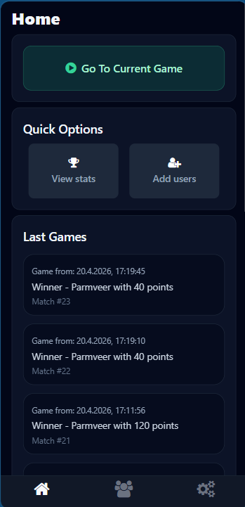
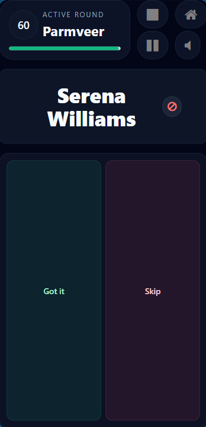
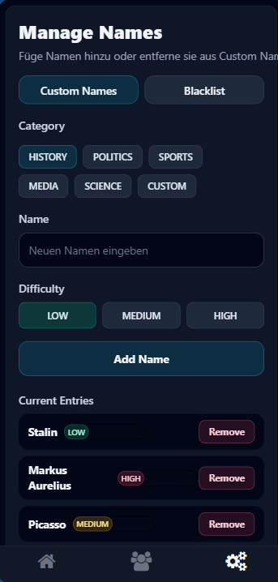
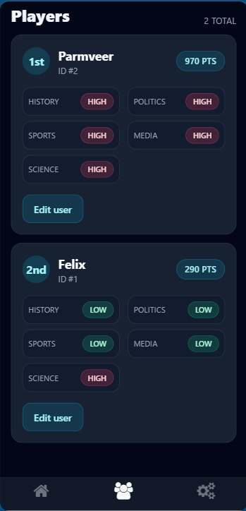
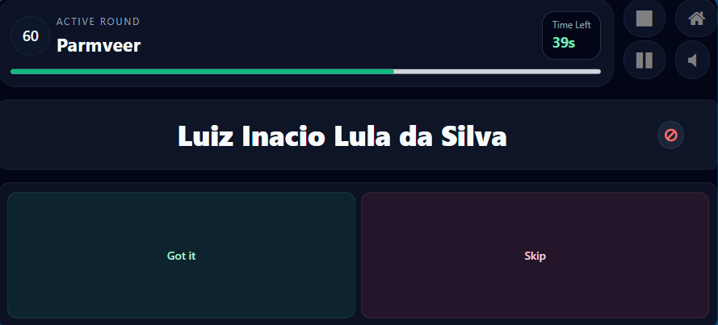

# WAI - Who Am I

WAI ist eine Quiz-Party-App auf Basis von Expo und React Native.
Spieler raten Namen aus verschiedenen Kategorien, sammeln Punkte und koennen eigene Inhalte verwalten.

## Hauptfeatures

- Mehrspieler-Quiz mit wechselnden aktiven Spielern pro Runde
- Punktesystem mit Speicherung der Spieler-Punkte
- Kategorien fuer Namen:
  - History
  - Media
  - Politics
  - Science
  - Sports
  - Custom
- Eigene Namen verwalten (Custom Names)
- Blacklist fuer unerwuenschte Namen
- Spielsteuerung waehrend der Runde:
  - Pause / Resume
  - Sound stumm / aktiv
  - Spiel beenden
- Alte Spiele und Ergebnisse auf dem Home-Screen
- Lokale Persistenz (Spieler, Einstellungen, Ergebnisse)
- Grundgeruest fuer Mehrsprachigkeit (i18n locales vorhanden)

## Tech Stack

- Expo + React Native
- Expo Router (Datei-basiertes Routing)
- TypeScript
- NativeWind / TailwindCSS
- React Navigation Tabs
- AsyncStorage (lokale Daten)

## Projektstruktur (Kurzuebersicht)

- app/: Screens und Routen
- components/: UI-Bausteine und Feature-Komponenten
- context/: Globaler App-Status
- scripts/: Spiel- und Auswahl-Logik
- assets/names/: Namensdaten pro Kategorie
- assets/images/languages/locales/: Sprachdateien

## Screenshots

Die folgenden Bilder sind direkt aus dem Ordner assets/screenshots eingebunden.

<table>
  <tr>
    <td align="center">
      <strong>Home</strong><br />
      
    </td>
    <td align="center">
      <strong>Live Game (Portrait)</strong><br />
      
    </td>
  </tr>
  <tr>
    <td align="center">
      <strong>Namen verwalten</strong><br />
      
    </td>
    <td align="center">
      <strong>Punkte-Uebersicht</strong><br />
      
    </td>
  </tr>
  <tr>
    <td colspan="2" align="center">
      <strong>Live Game (Landscape)</strong><br />
      
    </td>
  </tr>
</table>

## Lokale Entwicklung

### Voraussetzungen

- Node.js LTS
- npm
- Expo CLI (optional global, sonst via npx)

### Installation

```bash
npm install
```

### App starten

```bash
npm run start
```

### Zielplattform direkt starten

```bash
npm run android
npm run ios
npm run web
```

### Linting

```bash
npm run lint
```

## Bundling und Build

In diesem Projekt ist EAS Build bereits vorbereitet (siehe eas.json).

### 1) EAS CLI vorbereiten

```bash
npm install -g eas-cli
eas login
```

### 2) Build-Profile

- development: Development Client, interne Verteilung, Android APK
- preview: interne Verteilung, Android APK
- production: Release-Build, Android AAB (App Bundle), iOS Device Build

### 3) Build ausfuehren

#### Android Preview (APK)

```bash
eas build --platform android --profile preview
```

#### Android Production (AAB)

```bash
eas build --platform android --profile production
```

#### iOS Production

```bash
eas build --platform ios --profile production
```

### 4) Optional: App in Stores einreichen

```bash
eas submit --platform android --profile production
eas submit --platform ios --profile production
```

### 5) Lokales Web-Bundle (optional)

```bash
npx expo export --platform web
```

## Routing Ueberblick

- app/index.tsx
  - Leitet je nach Datenstatus weiter:
    - zu Onboarding, wenn noch zu wenige Nutzer vorhanden sind
    - sonst zur Home-Ansicht
- app/(quiz)/home.tsx
  - Einstieg in Spielstart, Quick-Optionen und alte Spiele
- app/(quiz)/users.tsx
  - Nutzer anzeigen und verwalten
- app/(quiz)/settings.tsx
  - Custom-Namen, AGB, Reset
- app/(game)/play.tsx
  - Hauptspiel mit Timer, Punkte, Antworten und Steuerung

## Hinweise

- Android package: com.felix08.wai
- Expo project name/slug: WAI / wai
- Fuer Production-Android wird ein AAB erstellt (Play Store geeignet).

## Roadmap (optional)

- Onboarding-Flow weiter ausbauen (Spieleranlage direkt im Onboarding)
- Mehr Sprachen aktiv in UI integrieren
- Detailliertere Statistik- und Verlaufsauswertung
